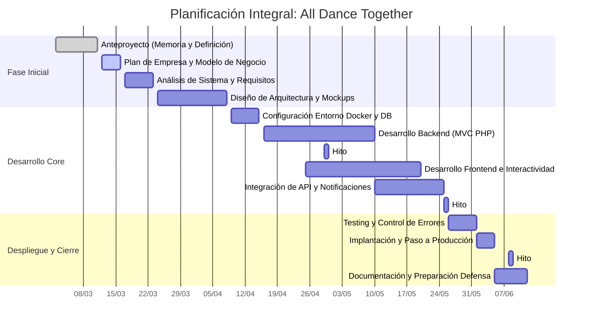

# Anteproyecto
- [1- Idea del proyecto](#1--idea-del-proyecto)
- [2- Contextualización](#2--contextualización)
- [3- Estudio de alternativas y viabilidad](#3--estudio-de-alternativas-y-viabilidad)
  - [3.1- Estudio de alternativas](#31--estudio-de-alternativas)
  - [3.2- Justificación de la alternativa](#32-justificación-de-la-alternativa)
- [4- Requerimientos técnicos](#4--requerimientos-técnicos)
- [5- Planificación](#5--planificación)

## 1- Idea del proyecto
**All Dance Together - Encuentra grupos de kpop dance cover a tu alrededor.**
Este proyecto nace con la ilusión de crear un punto de encuentro entre la comunidad "kpoper" de Galicia en un mismo espacio digital.
La idea es sencilla pero útil, ya que no existe dicha plataforma: centralizar en una sola web toda la información de grupos y solistas locales, contando con fichas de presentación, foros, sistema de noticias, acceso a las redes sociales, alertas de eventos próximos a ti, ¡incluso podrás crear tus propias quedadas y concursos! 
El concepto clave del proyecto es la unión de la comunidad. 

En cuanto al ámbito tecnológico, se usará HTML 5 y CSS 3 para la parte visual (frontend), conjuntamente con JavaScript para dotar a la web de dinamismo e interactividad, la lógica interna y gestión de datos con PHP, mientras que el almacenamiento de datos con MariaDB.

## 2- Contextualización
El propósito del proyecto es el desarrollo de una plataforma web integral diseñada para potenciar la socialización de la comunidad de dance cover de Kpop en Galicia. 
Actualmente, no existe un punto de encuentro único, ya que todo se divide en diversas redes sociales, lo que dificulta la localización de grupos, búsqueda de integrantes y difusión de eventos. 

El objetivo principal es centralizar la información del ámbito y sus integrantes, fomentar la colaboración con nuevos grupos, dinamizar la agenda cultural (con alertas y panel de eventos/quedadas), entre otros objetivos secundarios. 

Tras analizar las necesidades del ecosistema digital actual, me he dado cuenta que no se suele mostrar información local de forma eficiente. Por ello, he decidido apostar por una arquitectura simple pero eficiente. La decisión de tecnologías como PHP y MariaDB es debido a la necesidad de gestionar datos de forma robusta para los foros y registros de usuarios, mientras que Docker me asegura que la aplicación sea escalable y fácil de desplegar. 

En cuanto a la oportunidad de negocio y comercialización, aunque la idea nace con un espíritu comunitario y de software libre, tiene una clara oportunidad de negocio para el sector del ocio y cultura juvenil. La web puede ser un escaparate perfecto para tiendas de merchandising, academias de baile o tiendas con productos asiáticos; además, se podría comercializar la plataforma a modo de gestión de organizadores de concursos de baile, ofreciendo servicios premium o de venta de entradas. 

## 3- Estudio de alternativas y viabilidad
### 3.1- Estudio de alternativas
Alternativas
- A1- Desenvolvemento dende cero con API Rest java spring Boot + HTML5 + CSS3 + javascript nativo  
- A2- Desenvolvemento desde cero con API Rest Node.js + HTML5 + CSS3 + javascript nativo  .  
- A3- Desenvolvemento desde cero modelo MVC en php + HTML5 + CSS3 + javascript nativo.  

 | **Alternativa** |  **Viabilidade técnica** | **Viabilidade económica** | **Temporalidade** | **Valoración Global** |
 | ------ | ------ |  ------ | ------ | ------ |
 | A1 | Baixa-media (4/10): Se requiere dominar Spring Boot. **Fortalezas**: Arquitectura sólida y profesional. **Debilidades**: Curva de aprendizaje alta y configuración compleja. | Medio (6/10): Se necesita un hosting con soporte java | Baja (3/10): Entre 4 y 6 meses por la complejidad el framework. | **5/10** |
 | A2 | Media-Alta (7/10): Javascript es conocido pero la arquitectura API Rest requiere control de asincronía.  **Fortalezas:** Escalable y gestión de alertas en tiempo real. **Debilidades:** Gestión de paquetes y seguridad de la API |Alta (8/10): Hostings económicos y eficientes en consumo de memoria. |Media (6/10): Entre 3 y 4 meses. Desarrollo más ágil que en Java |**7/10** |
 | A3 | Alta (9/10): Tecnologías dominadas y con entorno aislado con Docker. **Fortalezas:** Rápido, simple y fácil de desplegar. **Debilidades:** Menos eficiente en tiempo real que con Node.js | Muy alta (9/10): Cualquier hosting soporta PHP/Docker. Coste mínimo de mantenimiento. | Alta (8/10): Entre 1 y 2 meses. Es la opción más rápida al ser un modelo conocido| **9/10** |

### 3.2 Justificación de la alternativa
Tras el análisis de las propuestas anteriores, elegí la alternativa A3 como la base del desarrollo para el proyecto. Esta decisión fue basada en los siguientes puntos clave: 
- Viabilidad técnica y control de entorno. El uso de Docker me garantiza un entorno de desarrollo idéntico al de producción, eliminando errores de compatibilidad y facilitándome el despliegue de los servicios. 
- Curva de aprendizaje optimizada. Al emplear tecnologías ya conocidas el esfuerzo se centra directamente en la lógica del programa, en lugar de invertir tiempo en configurar frameworks. 
- Rapidez en el desarrollo al usar MVC en PHP me permite estructurar el proyecto de una forma escalable en un tiempo reducido, garantizando que el programa funcione en pocas semanas. 
- Fricción mínima de despliegue. Al combinar PHP y Docker permite que el paso a producción sea prácticamente instantáneo, asegurando que todo funciona correctamente desde el primer momento. 

La alternativa con Node.js (A2) se valoró por la modernidad y ser adecuada para la gestión de eventos en tiempo real; sin embargo, fue descartada ya que consideré que debía priorizar la estabilidad del proyecto y asegurar el cumplimiento de los plazos de entrega utilizando lenguajes y herramientas ya conocidas. 

## 4- Requirimientos técnicos
### Infraestructura y despliegue
- Contenedores (Docker y Docker Compose).
- Servidor de Base de datos para MariaDB. 
- Servidor web con Apache. 
- Entorno de ejecución para PHP con las extensiones necesarias para la conexión de la base de datos con PDO. 
- Gestión de dependencias con composer.

### Backend (Lógica de Negocio)
Se opta por un desarrollo robusto por parte del servidor sin depender de frameworks siguiendo el patrón MVC. 
- Lenguaje: PHP versión 8.4 .
- Técnicas: Programación orientada a objetos y uso de PDO para realizar consultas y prevenir ataques de inyección.
- Gestión de sesiones: Sistema nativo de PHP para el control de acceso de usuarios de la web. 
- API: Implementación de endpoints internos en PHP para gestionar las asincronías del frontend.

### Frontend (Interfaz de Usuario)
- Estructura: HTML5. 
- Estilos: CSS3. 
- Interactividad: Javascript nativo. 
- Librerías: FontAwesome (iconografía) y Google Fonts (tipografía).

## 5- Planificación
La creación total del proyecto se llevará a cabo en unas 14 semanas aproximadamente. 
- Estudio preliminar: 1 semana (día límite 10/03/2026).  
- Análisis: 1 semana y media (día límite 22/03/2026). 
- Diseño: 2 semanas y media (día límite 07/04/2026).
- Codificación y pruebas: para la primera entrega: 3 semanas y para la segunda: 3 semanas y media (día límite primera fecha: 29/04/2026 y de la segunda fecha: 24/05/2026).
- Implantación: 1 semana (fecha límite 31/05/2026).
- Entrega final: 1 semana (fecha límite 07/06/2026).

### Diagrama de gantt 

[**<-Anterior**](../README.md)
