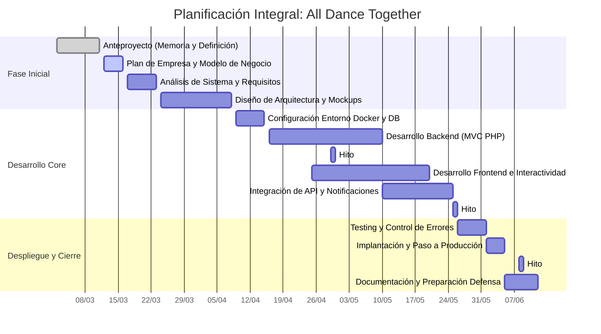

# Anteproyecto
- [1- Idea del proyecto](#1--idea-del-proyecto)
- [2- Contextualización](#2--contextualización)
- [3- Estudio de alternativas y viabilidad](#3--estudio-de-alternativas-y-viabilidad)
  - [3.1- Estudio de alternativas](#31--estudio-de-alternativas)
  - [3.2- Justificación de la alternativa](#32-justificación-de-la-alternativa)
- [4- Requerimientos técnicos](#4--requerimientos-técnicos)
- [5- Planificación](#5--planificación)

## 1- Idea del proyecto
**All Dance Together - Encuentra grupos de kpop dance cover a tu alrededor.**
Este proyecto nace con la ilusión de crear un punto de encuentro entre la comunidad "kpoper" de Galicia en un mismo espacio digital.
La idea es sencilla pero útil, ya que no existe dicha plataforma: centralizar en una sola web toda la información de grupos y solistas locales, contando con fichas de presentación, foros, sistema de noticias, acceso a las redes sociales, alertas de eventos próximos a ti, ¡incluso podrás crear tus propias quedadas y concursos! 
El concepto clave del proyecto es la unión de la comunidad. 

En cuanto al ámbito tecnológico, se usará HTML 5 y CSS 3 para la parte visual (frontend), conjuntamente con JavaScript para dotar a la web de dinamismo e interactividad, la lógica interna y gestión de datos con PHP, mientras que el almacenamiento de datos con MariaDB.

## 2- Contextualización
El propósito del proyecto es el desarrollo de una plataforma web integral diseñada para potenciar la socialización de la comunidad de dance cover de Kpop en Galicia. 
Actualmente, no existe un punto de encuentro único, ya que todo se divide en diversas redes sociales, lo que dificulta la localización de grupos, búsqueda de integrantes y difusión de eventos. 

El objetivo principal es centralizar la información del ámbito y sus integrantes, fomentar la colaboración con nuevos grupos, dinamizar la agenda cultural (con alertas y panel de eventos/quedadas), entre otros objetivos secundarios. 

Tras analizar las necesidades del ecosistema digital actual, me he dado cuenta que no se suele mostrar información local de forma eficiente. Por ello, he decidido apostar por una arquitectura simple pero eficiente. La decisión de tecnologías como PHP y MariaDB es debido a la necesidad de gestionar datos de forma robusta para los foros y registros de usuarios, mientras que Docker me asegura que la aplicación sea escalable y fácil de desplegar. 

En cuanto a la oportunidad de negocio y comercialización, aunque la idea nace con un espíritu comunitario y de software libre, tiene una clara oportunidad de negocio para el sector del ocio y cultura juvenil. La web puede ser un escaparate perfecto para tiendas de merchandising, academias de baile o tiendas con productos asiáticos; además, se podría comercializar la plataforma a modo de gestión de organizadores de concursos de baile, ofreciendo servicios premium o de venta de entradas. 

## 3- Estudio de alternativas y viabilidad
### 3.1- Estudio de alternativas
Alternativas:
- A1- Desarrollo desde cero con API Rest Java Spring Boot + HTML5 + CSS3 + Javascript nativo.
- A2- Desarrollo desde cero con API Rest Node.js + HTML5 + CSS3 + Javascript nativo.
- A3- Desarrollo desde cero modelo MVC en PHP + HTML5 + CSS3 + Javascript nativo.

| **Alternativa** | **Viabilidad técnica** | **Viabilidad económica** | **Temporalidad** | **Valoración Global** |
| ------ | ------ | ------ | ------ | ------ |
| A1 | Baixa-media (4/10): Alta curva de aprendizaje y configuración compleja. | Medio (6/10): Hosting con soporte Java. | Baja (3/10): 4-6 meses. | **5/10** |
| A2 | Media-Alta (7/10): Arquitectura API Rest requiere control asincronía. | Alta (8/10): Hosting eficiente y escalable. | Media (6/10): 3-4 meses. | **7/10** |
| A3 | Alta (9/10): Tecnologías dominadas. | Muy alta (9/10): Coste mínimo y gran compatibilidad. | Alta (8/10): 1-2 meses. | **9/10** |

### 3.2 Justificación de la alternativa
Tras el análisis de las propuestas anteriores, elegí la alternativa **A3** como base del desarrollo por los siguientes puntos clave: 
- **Curva de aprendizaje optimizada:** Al emplear tecnologías nativas y un patrón MVC conocido, el esfuerzo se centra en la lógica del negocio y la funcionalidad, evitando la complejidad innecesaria de configurar frameworks pesados.
- **Rapidez y escalabilidad:** El uso de PHP puro bajo arquitectura MVC permite una estructura limpia, modular y fácil de mantener, garantizando que el proyecto sea funcional en los plazos previstos.
- **Control total del código:** Al no depender de librerías externas o frameworks de terceros (como Spring Boot), tengo un control absoluto sobre la seguridad y el rendimiento de la aplicación, facilitando auditorías de código.
- **Eficiencia en el desarrollo:** Al trabajar con tecnologías que domino, puedo dedicar más tiempo a la calidad de la interfaz de usuario y la experiencia de los integrantes de la comunidad, asegurando un despliegue sin errores.

## 4- Requerimientos técnicos
### Infraestructura y despliegue (Hosting)
Para la puesta en producción, la plataforma requiere un hosting que garantice estabilidad y compatibilidad con el stack tecnológico (PHP 8.4 y MariaDB). Se optará por un **Servidor VPS (Virtual Private Server)**:
- **Servidor Web:** Apache 2.4 o superior, configurado para soportar el patrón MVC (gestión de .htaccess).
- **Entorno de ejecución:** PHP 8.4, con extensiones pdo_mysql, mbstring y gd.
- **Base de Datos:** MariaDB 10.x para persistencia de datos y consultas optimizadas.
- **Sistema Operativo:** Linux (Debian/Ubuntu Server) para gestión eficiente de permisos y seguridad.
- **Escalabilidad:** Servidor con al menos 2GB de RAM para manejar tráfico inicial.

### Backend (Lógica de Negocio)
- Lenguaje: PHP 8.4 con Programación Orientada a Objetos.
- Seguridad: Uso de PDO para prevenir inyecciones SQL.
- Sesiones: Sistema nativo para control de acceso.

### Frontend (Interfaz de Usuario)
- Estructura: HTML5, CSS3, Javascript nativo.
- Optimización: Eventos delegados en JS para mejorar el rendimiento.
- Librerías: FontAwesome y Google Fonts.

## 5- Planificación
La creación total del proyecto se llevará a cabo en unas 14 semanas aproximadamente. 
- Estudio preliminar: 1 semana (día límite 10/03/2026).  
- Análisis: 1 semana y media (día límite 22/03/2026). 
- Diseño: 2 semanas y media (día límite 07/04/2026).
- Codificación y pruebas: para la primera entrega: 3 semanas y para la segunda: 3 semanas y media (día límite primera fecha: 29/04/2026 y de la segunda fecha: 24/05/2026).
- Implantación: 1 semana (fecha límite 31/05/2026).
- Entrega final: 1 semana (fecha límite 07/06/2026).

### Diagrama de gantt 

```mermaid
gantt
    title Planificación Integral: All Dance Together
    dateFormat  YYYY-MM-DD
    axisFormat %d/%m
    
    section Fase Inicial
    Anteproyecto (Memoria y Definición) :done, 2026-03-02, 2026-03-11
    Plan de Empresa y Modelo de Negocio :active, 2026-03-12, 2026-03-16
    Análisis de Sistema y Requisitos     : 2026-03-17, 2026-03-23
    Diseño de Arquitectura y Mockups    : 2026-03-24, 2026-04-08

    section Desarrollo Core
    Configuración Entorno Docker y DB    : 2026-04-09, 2026-04-15
    Desarrollo Backend (MVC PHP)         : 2026-04-16, 2026-05-10
    Hito: 1ª Entrega Funcional           : milestone, 2026-04-29, 1d
    Desarrollo Frontend e Interactividad : 2026-04-25, 2026-05-20
    Integración de API y Notificaciones  : 2026-05-10, 2026-05-25
    Hito: 2ª Entrega (Versión Beta)      : milestone, 2026-05-25, 1d

    section Despliegue y Cierre
    Testing y Control de Errores         : 2026-05-26, 2026-06-01
    Implantación y Paso a Producción     : 2026-06-01, 2026-06-05
    Hito: Entrega Final                  : milestone, 2026-06-08, 1d
    Documentación y Preparación Defensa  : 2026-06-05, 2026-06-12
```
[**<-Anterior**](../../README.md)
