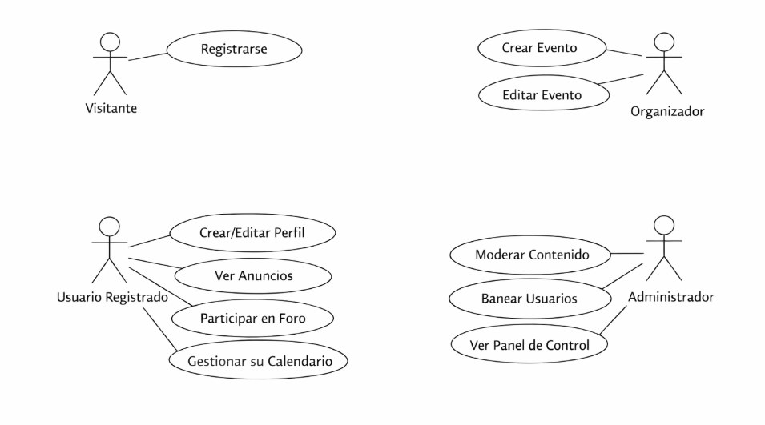
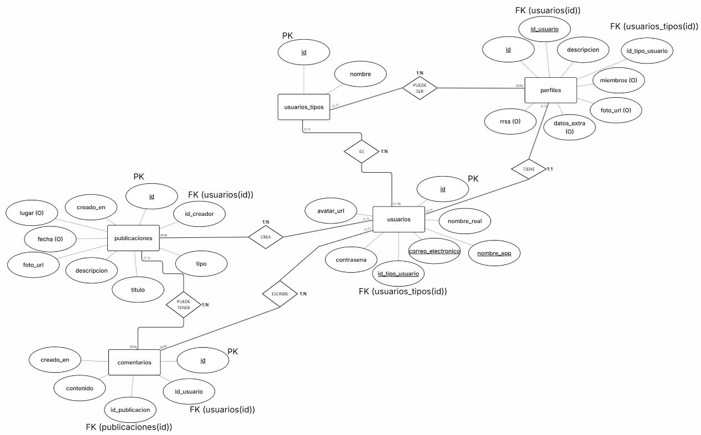

# FASE DE DESEÑO

- [FASE DE DESEÑO](#fase-de-deseño)
  - [1- Diagrama da arquitectura](#1--diagrama-da-arquitectura)
  - [2- Casos de uso](#2--casos-de-uso)
  - [3- Diagrama de Base de Datos](#3--diagrama-de-base-de-datos)
  - [4- Diseño de interfaz de usuarios](#4--diseño-de-interfaz-de-usuarios)

## 1- Diagrama da arquitectura
La arquitectura de All Dance Together se basa en un modelo Cliente-Servidor estructurado en tres capas, utilizando el patrón de diseño MVC (Modelo-Vista-Controlador) para separar la lógica de negocio de la interfaz de usuario. 


### Descripción de las capas:
- **Capa de Presentación (Frontend):** Construida con HTML5, CSS3 y JavaScript nativo. Se encarga de renderizar las fichas de los grupos, el calendario de eventos y los foros de discusión, asegurando una experiencia responsive para dispositivos móviles y escritorio.
- **Capa de Negocio (Backend):** Implementada en PHP 8.4 siguiendo el patrón MVC. Procesa las peticiones del usuario, gestiona la lógica de las notificaciones de eventos próximos y asegura la comunicación con la base de datos de forma segura.
- **Capa de Datos:** Gestionada por un servidor MariaDB. El acceso a los datos se realiza exclusivamente mediante PDO (PHP Data Objects) para prevenir ataques de inyección SQL y garantizar la integridad de la información de la comunidad.

### Diagrama de componentes y despliegue:

```mermaid
graph LR
    subgraph "Cliente"
        A[Navegador Web]
    end

    subgraph "Servidor de Aplicaciones"
        B[Servidor Web: Apache]
        C[Lógica de Negocio: PHP 8.4 MVC]
    end

    subgraph "Servidor de Datos"
        D[(MariaDB)]
    end

    A <-->|Peticiones HTTP/HTTPS| B
    B --- C
    C <-->|Conexión Segura PDO| D
  ```

### Estrategia de despliegue 
Para garantizar la portabilidad y un entorno de ejecución idéntico entre el desarrollo y la producción, el sistema se despliega mediante la herramienta Docker Compose. Esta tecnología permite definir y ejecutar aplicaciones multicontenedor, facilitando la gestión de las dependencias entre el servidor web y la base de datos. En entornos de producción, esta configuración base permite escalar la infraestructura hacia orquestadores como Docker Swarm o Kubernetes en caso de que se quisiera.

Para automatizar este proceso, se ha desarrollado un script de instalación (`install.sh`) que realiza las siguientes funciones:
* **Validación:** Comprueba la presencia de Docker y Docker Compose en el sistema anfitrión.
* **Limpieza:** Ejecuta `docker compose down` para asegurar un despliegue limpio, eliminando contenedores previos.
* **Construcción y Despliegue:** Ejecuta `docker compose build` y `docker compose up -d` para levantar los servicios de forma desatendida.
* **Verificación:** Realiza un sondeo mediante `curl` para confirmar que la aplicación está operativa y lista para su uso.

## 2- Casos de uso
### Actores del Sistema
| Actor | Descripción | Nivel de Acceso |
|-------|-------------|-----------------|
| Visitante (Anónimo) | Persona que puede acceder a la pantalla de regsitro |
| Usuario Registrado | Bailarín o grupo que se ha autenticado | Lectura/Escritura en su perfil |
| Organizador | Usuario con permisos para crear y gestionar eventos | Lectura/Escritura de eventos |
| Administrador | Superusuario con control total del sistema | Control total |



## 3- Diagrama de Base de Datos


**Leyenda:** ◉ = Atributo identificador (clave primaria) • = Atributo descriptor | FK = Clave foránea (relación)

| # | Relación | Entidad 1 | Entidad 2 | Cardinalidad | Atributo FK | Descripción |
|---|-----------|------------|------------|--------------|--------------|-------------|
| R1 | ES | USUARIOS_TIPOS | USUARIOS | 1:N | id_tipo_usuario | Un tipo de usuario puede pertenecer a múltiples usuarios |
| R2 | PUEDE_SER | USUARIOS_TIPOS | PERFILES | 1:N | id_tipo_usuario | Un tipo de usuario puede estar asociado a múltiples perfiles |
| R3 | TIENE | USUARIOS | PERFILES | 1:1 | id_usuario | Un usuario tiene un único perfil asociado |
| R4 | CREA | USUARIOS | PUBLICACIONES | 1:N | id_creador | Un usuario puede crear múltiples publicaciones |
| R5 | ESCRIBE | USUARIOS | COMENTARIOS | 1:N | id_usuario | Un usuario puede escribir múltiples comentarios |
| R6 | PUEDE_TENER | PUBLICACIONES | COMENTARIOS | 1:N | id_publicacion | Una publicación puede tener múltiples comentarios |


## 4- Diseño de interfaz de usuarios
https://www.figma.com/design/ukKq3Y8y8XER9wNLB7jRoA/Demo-All-Dance-Together?m=auto&t=bVj0iDurSxHSnzT7-6

[<-Anterior](../../README.md)
